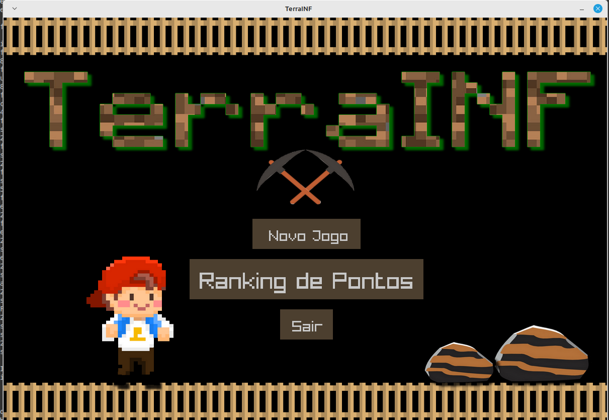

# Sobre o Projeto

Esse é um projeto de um jogo em linguagem C, chamado **TerraINF**.

## Como Executar

Para executar o jogo, existem duas maneiras:

1. **Compilando o código-fonte:**  
   - Baixe o código-fonte e os assets para uma mesma pasta.  
   - Abra o código na IDE de preferência e compile.  
   - Além disso, é necessário baixar e configurar a biblioteca **raylib** na IDE.  

2. **Baixando o arquivo `jogoCompleto.zip` em release:**  
   - Ele contém o `jogoTerraINF.exe` pronto para rodar junto com os arquivos de áudio e imagem necessários.

## Como Funciona o Jogo

No jogo, você movimenta o jogador em um espaço **2D** e tem como objetivo obter o maior número de pontos ao extrair minérios do mapa.  

No **menu**, há três opções: **Ranking, Sair e Novo Jogo**.

### Regras do jogo:
- Use as teclas **W (cima), S (baixo), A (esquerda) e D (direita)** para se movimentar.  
  - O movimento **vertical** só é permitido quando o jogador estiver sobre uma escada.  
  - O movimento **horizontal** é liberado nos espaços livres do cenário (caracter vazio).  
- Use **Shift (esquerdo)** para **usar uma escada** (começa-se com 20 escadas por fase).  
- Tecle **1** para ativar/desativar o **modo mineração**, e **W, S, A ou D + Espaço** para minerar.  
- Se o jogador cair uma distância maior que **3 blocos** (3 caracteres vazios), ele **perde uma vida**.  
- Ao garimpar e encontrar um **metal precioso**, sua **força** e **pontuação** aumentam:  

  | Minério  | Aumento de Força | Pontuação |
  |----------|-----------------|-----------|
  | Titânio  | +30             | +150      |
  | Ouro     | +20             | +100      |
  | Prata    | +10             | +50       |
  | **Césio**  | **-20**        | -         |
  | **Urânio** | **-30**        | -         |

- **Remover um bloco de terra** reduz **3 pontos de força**.  
- Quando sua **força chegar a 20**, o jogador **perde uma vida**.  
  - Se ainda tiver vidas, a força será **restituída para 100**.  
- **Ao perder as 3 vidas, o jogo termina**.  
- Quando o jogo acaba (seja por perder todas as vidas ou passar por todas as fases), uma **tela correspondente** será exibida.  
- Caso tenha pontuação suficiente, você poderá **incluir seu nome no ranking**!  

### Importante:
Para que o jogo funcione corretamente, **todos os arquivos** (código, imagens e áudio) devem ser baixados e mantidos **no mesmo diretório**, sem conflito de nomes com outros arquivos.

---

## Imagens do Jogo

### Tela Inicial  
  

### Início do Jogo  
  

### Início do Nível 2  
  

### Usando Escada  
  

### Passar de Fase  
  

### Fim do Jogo  
  
